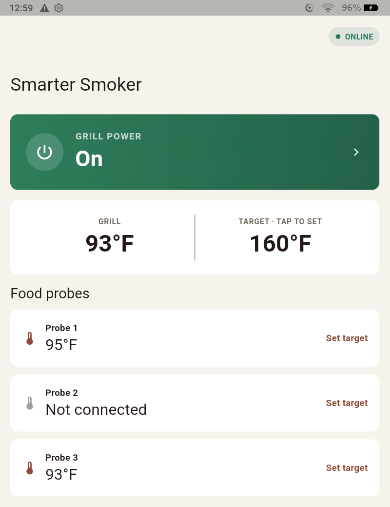
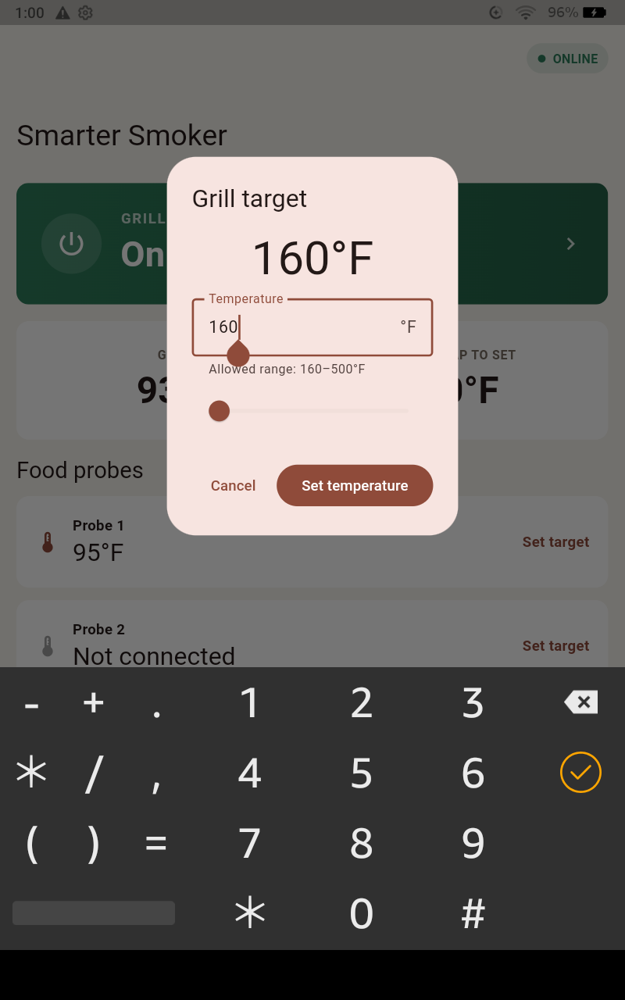
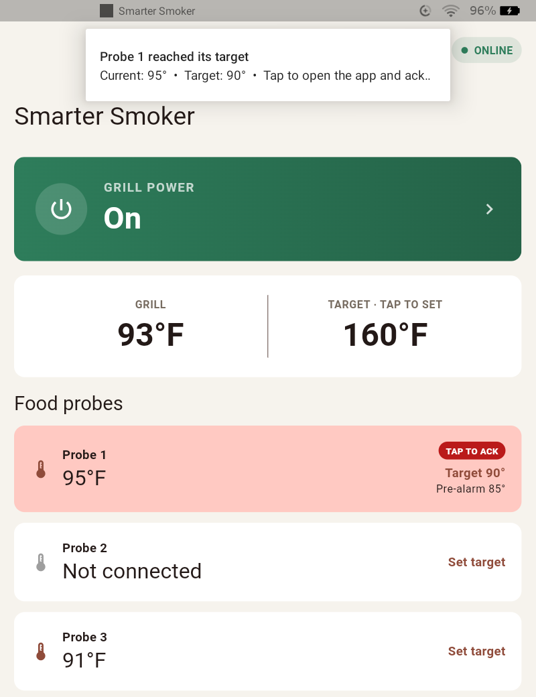

# Smarter Smoker

An experimental, Wi-Fi-first controller for compatible Smarter Grills/Taylor
pellet-smoker controllers. The Flutter application supports Android and iOS
source builds from a single project.

## Features

- Automatic MQTT connection using a saved `GRILL...` device ID
- BLE-assisted Grill ID discovery
- BLE Wi-Fi provisioning for 2.4 GHz networks
- Automatic grill status and temperature refresh
- Grill power and temperature control
- Persistent count-up and count-down cook timer with Android completion alerts
- Multi-stage cook plans with manual, ask-first, or automatic advancement
- Stage completion based on chamber temperature, elapsed time, or probe target
- Android CookBook recipe-file import with editable suggested cook plans
- Three food-probe readings with locally stored software alarm targets
- Visual, audible, and haptic probe pre-alarms and target alarms
- Public lock-screen notifications for probe alerts on Android
- Smoker-ready sound and lock-screen notification at the chamber setpoint
- Shared binary protocol codec with tests
- Responsive Material 3 dashboard and diagnostics log

See the [project wiki](https://github.com/wwhitmoyer/SmarterSmokerController/wiki)
for installation and usage guidance, including
[cook plans and CookBook import](https://github.com/wwhitmoyer/SmarterSmokerController/wiki/Cook-Plans-and-CookBook-Import).
The reverse-engineered protocol notes are also available locally in
[docs/wifi-mqtt-protocol.md](docs/wifi-mqtt-protocol.md).

## Cook workflow

- Use the dashboard timer as a persistent count-up stopwatch or named
  countdown. Starting, pausing, and resuming a countdown updates its scheduled
  Android completion alarm.
- On Android, open a supported CookBook recipe file with Smarter Smoker to
  import its ingredients and directions. The app extracts a suggested
  multi-stage cook plan when temperatures and durations are recognized.
- Review every imported stage before starting. You can edit its smoker target,
  duration or probe target, and whether the app advances manually,
  automatically, or only after approval.
- Active cook plans persist locally and can be paused, resumed, advanced, or
  closed from the dashboard.

## Screenshots

<p align="center">
  
  
  
</p>

<p align="center">
  Dashboard &nbsp; • &nbsp; Temperature control &nbsp; • &nbsp; Probe alarm
</p>

## Development

From the repository root:

```text
flutter pub get
flutter test
flutter analyze
flutter run
```

Build an Android debug APK with:

```text
flutter build apk --debug
```

Android and iOS BLE/network permissions are configured. Building and signing
the iOS application requires Xcode on macOS.

## Project status

This is an independent reverse-engineering and interoperability project. It is
not affiliated with or endorsed by the grill manufacturer or app vendor. Use it
only with equipment you own.

## Security

The vendor system uses unencrypted MQTT and a shared credential embedded in the
vendor APK. Device IDs and cook data should be treated as sensitive. Do not scan,
enumerate, or attempt to access devices you do not own.
